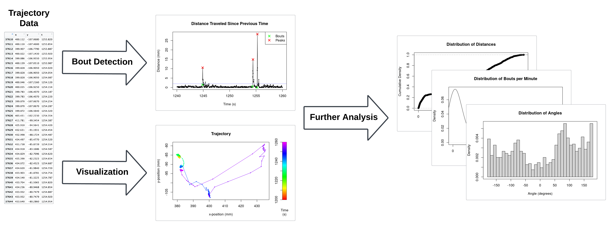

<!-- README.md is generated from README.Rmd. Please edit that file -->

# zltrajectory

<!-- badges: start -->
<!-- badges: end -->

## Description

`zltrajectory` is an R package designed for analyzing 2D movement data
on zebrafish larvae. Due to their behavior of swimming in discrete
bouts, consisting of an initial burst of speed, this package is
primarily designed to identify where the beginnings of swim bouts occur
given the trajectory of a zebrafish larva.

The algorithm used for bout detection involves finding peaks in a time
series of distances traveled between consecutive time points recorded in
the data. As such, this may work better on data with high frame rates
where changes in position are more frequently captured.

The environment listed below was used to develop this package.

- `R version 4.3.2 (2023-10-31)`
- `Platform: x86_64-pc-linux-gnu (64-bit)`
- `Running under: Ubuntu 22.04.4 LTS`

## Installation

Use the following commands to install the latest development version of
the package.

``` r
install.packages("devtools")
devtools::install_github("RobinEatingWorm/zltrajectory_private")
library(zltrajectory)
```

Use the following command to run the Shiny app.

``` r
# Under construction
```

## Overview

Use the following commands to browse the available functions, datasets,
and vignettes in this package.

``` r
ls("package:zltrajectory")
data(package = "zltrajectory")
browseVignettes("zltrajectory")
```

`zltrajectory` contains 8 functions.

1.  `create_trajectory` creates a data frame containing trajectory
    information that is usable in other functions within this package.
2.  `plot_trajectory` generates a visualization of a zebrafish larva’s
    position in 2D space across time.
3.  `plot_diagnostics` generates a diagnostic plot of of distances
    traveled between consecutive observations in the data to assist
    users in selecting the parameters of `find_bouts`.
4.  `find_bouts` returns indices in the trajectory data frame
    corresponding to when bouts begin.
5.  `calculate_angles` returns trajectory angles for consecutive groups
    of three observations or bouts.
6.  `calculate_bouts_per_time_unit` returns the number of bouts per time
    unit specified.
7.  `calculate_distances` returns distances between consecutive pairs of
    observations or bouts.
8.  `plot_distribution` generates a visualization of the distribution of
    a vector of values. Supported visualization types include
    histograms, kernel density estimates (KDEs), and empirical
    cumulative distribution functions (ECDFs).

This package also contains a sample dataset named `cadmium_zebrafish`
adapted from Nuesser (2016). Refer to the documentation of
`cadmium_zebrafish` for more details.

An illustration showing an overview of this package is shown below.

<figure>

<figcaption aria-hidden="true">An overview of zltrajectory</figcaption>
</figure>

## Contributions

The author of the package is Gavin Pu. The author wrote the `find_bouts`
function using the R package `pracma` to detect peaks (local maxima) in
a time series of distances traveled between consecutive time points
recorded in data. The base R packages `graphics` and `grDevices` were
used in the plotting function `plot_diagnostics`, `plot_trajectory`, and
`plot_distribution` to generate their respective plots. Additionally,
`plot_distribution` depends on the base R package `stats` to calculate
KDEs and ECDFs. No other dependencies were used in the source code of
this package. Generative AI tools were not used in the development of
this package.

## References

Borchers, H. W. (2023). *pracma: Practical Numerical Math Functions*.

Kawashima, T., Zwart, M. F., Yang, C.-T., Mensh, B. D., & Ahrens, M. B.
(2016). The Serotonergic System Tracks the Outcomes of Actions to
Mediate Short-Term Motor Learning. *Cell*, *167*(4), 933-946.e20.
<https://doi.org/10.1016/j.cell.2016.09.055>

Nuesser, L. (2016). Designating a segregation parameter for
contamination detection in behavioral assays using zebrafish larvae;
supporting information (Version 4). figshare.
<https://doi.org/10.6084/m9.figshare.3102133.v4>

Nüßer, L. K., Skulovich, O., Hartmann, S., Seiler, T.-B., Cofalla, C.,
Schuettrumpf, H., Hollert, H., Salomons, E., & Ostfeld, A. (2016). A
sensitive biomarker for the detection of aquatic contamination based on
behavioral assays using zebrafish larvae. *Ecotoxicology and
Environmental Safety*, *133*, 271–280.
<https://doi.org/10.1016/j.ecoenv.2016.07.033>

R Core Team. (2023). *R: A Language and Environment for Statistical
Computing*. R Foundation for Statistical Computing.
<https://www.R-project.org/>

Tadres, D., & Louis, M. (2020). PiVR: An affordable and versatile
closed-loop platform to study unrestrained sensorimotor behavior. *PLoS
Biology*, *18*(7), e3000712.
<https://doi.org/10.1371/journal.pbio.3000712>
